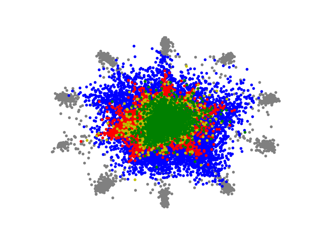

# Adversarial Motorial Prototype Framework for Open Set Recognition
Official PyTorch implementation of
["**Adversarial Reciprocal Points Learning for Open Set Recognition**"](https://arxiv.org/abs/2108.04225). 
It needs to say, these codes are modified by http://github.com/iCGY96/ARPL.


## 1. Requirements
### Environments
These codes are supposed to be run with a Linux system. If you use Windows system to run them,
it may encounter some errors.

Currently, requires following packages
- python 3.6+
- torch 1.4+
- torchvision 0.5+
- CUDA 10.1+
- scikit-learn 0.22+

### Datasets
For Tiny-ImageNet, please download the following datasets to ```./data/tiny_imagenet``` and unzip it.
-   [tiny_imagenet](https://drive.google.com/file/d/1oJe95WxPqEIWiEo8BI_zwfXDo40tEuYa/view?usp=sharing)

## 2. Training 

### Open Set Recognition
To train open set recognition models in paper, run this command:
```train
python osr.py --dataset <DATASET> --loss <LOSS>
```
> Option 
> 
> --loss can be one of ARPLoss/RPLoss/GCPLoss/Softmax/AMPFLoss.
> 
> --dataset is one of mnist/svhn/cifar10/cifar100/tiny_imagenet.
> 
> To run ARPL+CS, add --cs after this command.
> 
> To run MPF, just use --loss AMPFLoss.
> 
> To run AMPF, use --loss AMPFLoss --cs. 
> 
> To run AMPF++, use --loss AMPFLoss --cs++.


## 3. Results
### We visualize the deep feature of Softmax/GCPL/RPL/ARPL/MPF as below.

<p align="center">
    /MPFLoss_visualize_open_set.png width="800">
</p>

Before getting the figure above, you need to train the LeNet++ network, whose architecture is in "./models/model.py".


## Citation
- If you find our work or the code useful, please consider cite our paper using:
```bibtex
@misc{xia2021adversarial,
      title={Adversarial Motorial Prototype Framework for Open Set Recognition}, 
      author={Ziheng Xia and Penghui Wang and Ganggang Dong and Hongwei Liu},
      year={2021},
      eprint={2108.04225},
      archivePrefix={arXiv},
      primaryClass={cs.CV}
}
```
